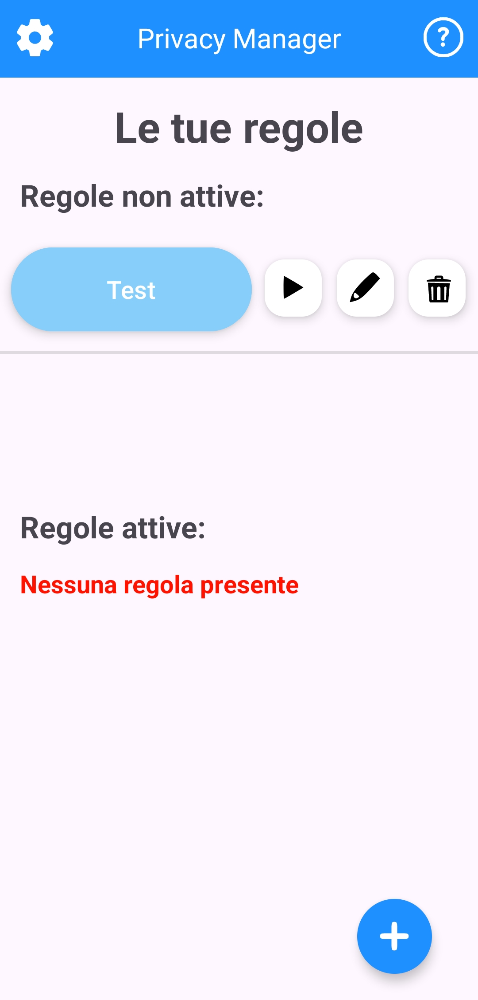
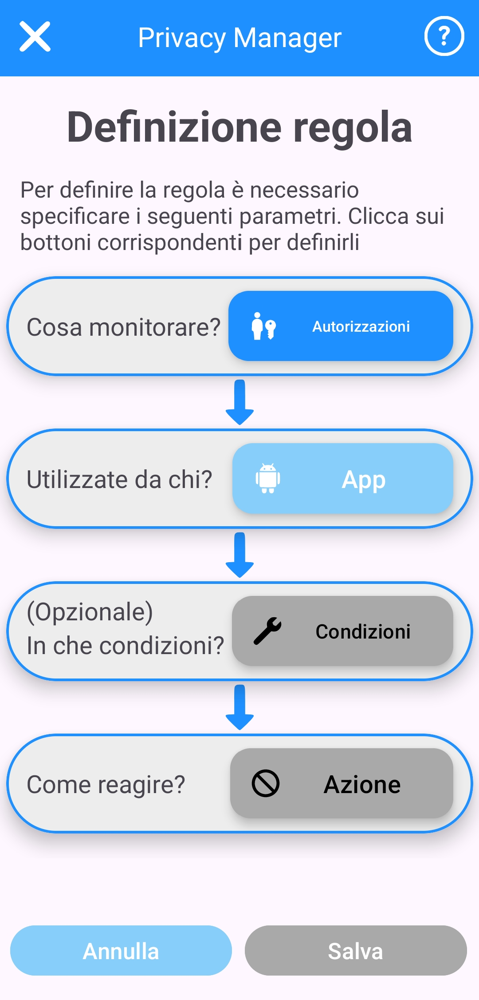
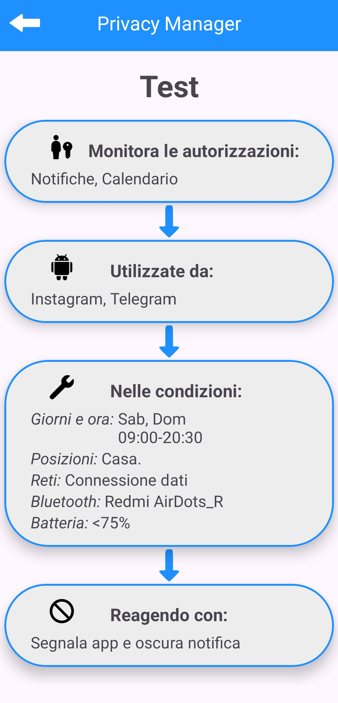
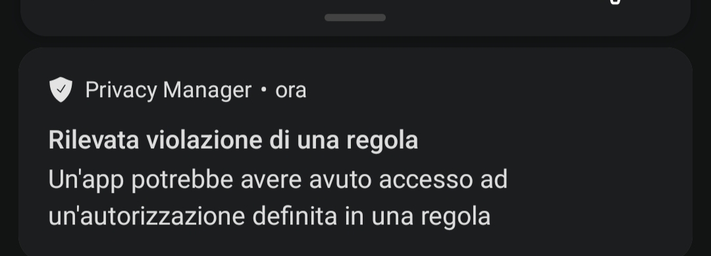
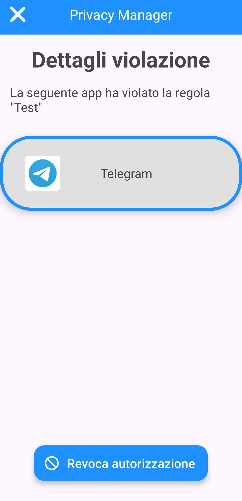
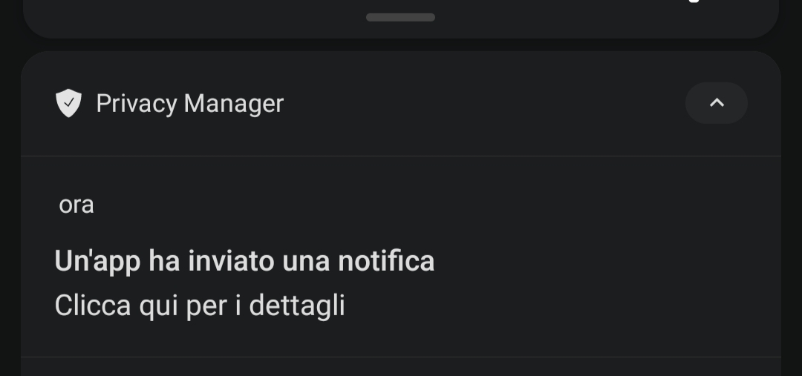
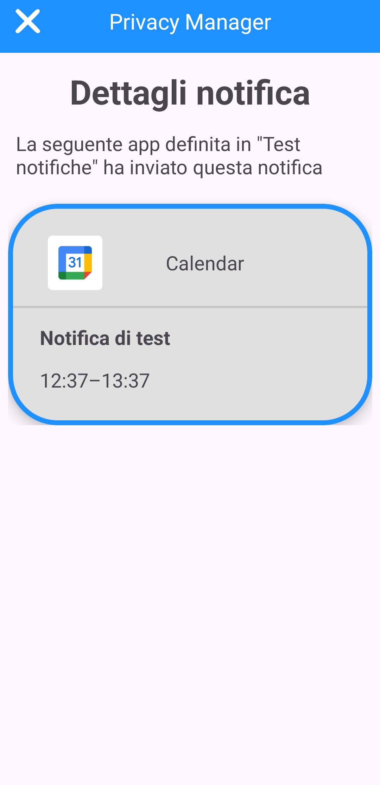

# PrivacyManager
Applicazione mobile per sistemi Android che permette agli utenti di gestire la privacy e la sicurezza dei propri dati in maniera personalizzata.
Progetto di tesi realizzato al Politecnico di Torino, anno accademico 2023-2024

# Caratteristiche del sistema
Gli utenti dell'app hanno la possibilità di definire delle regole di sicurezza, e di adattare il comportamento di queste in base alle proprie esigenze personali. L'approccio usato è quello dell'End-User Development.
Il comportamento del sistema prevede il monitoraggio delle app usate dall'utente e le funzionalità (autorizzazioni) che vengono richieste da queste. Il sistema si occupa quindi di segnalare all'utente le eventuali problematiche di privacy che vengono riscontrate, in base alle regole di sicurezza definite dall'utente

# Screenshot

